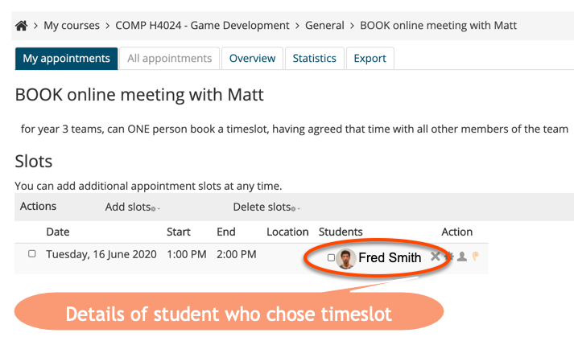
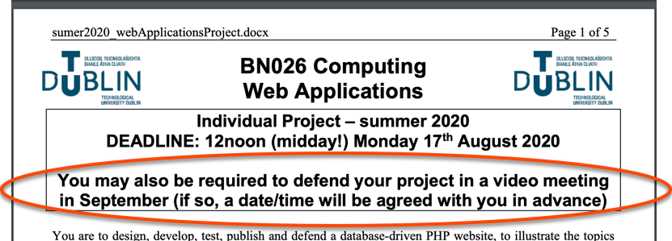
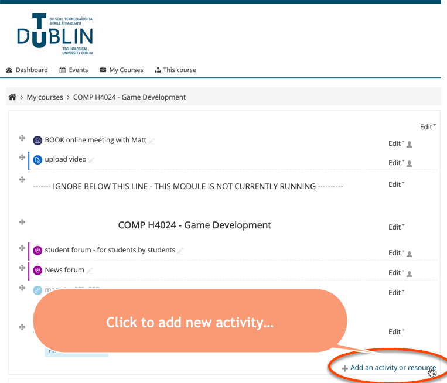
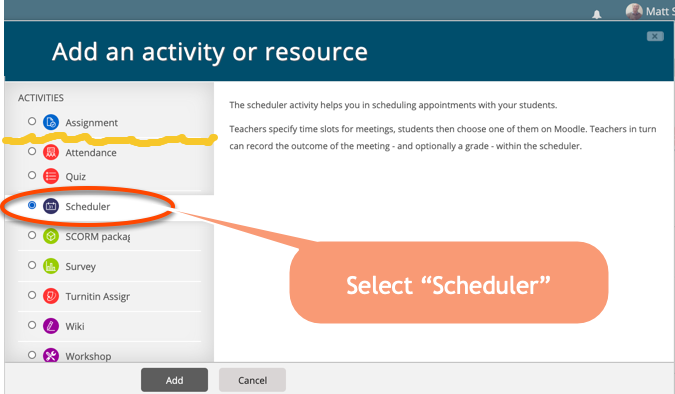
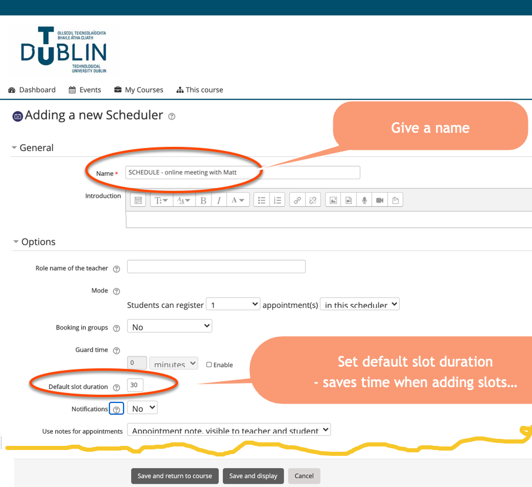
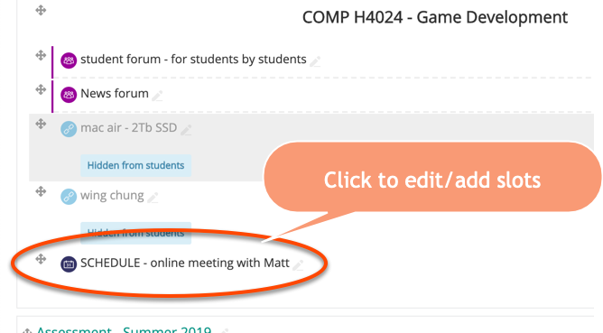
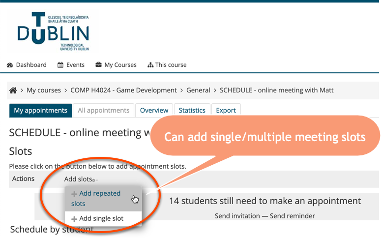
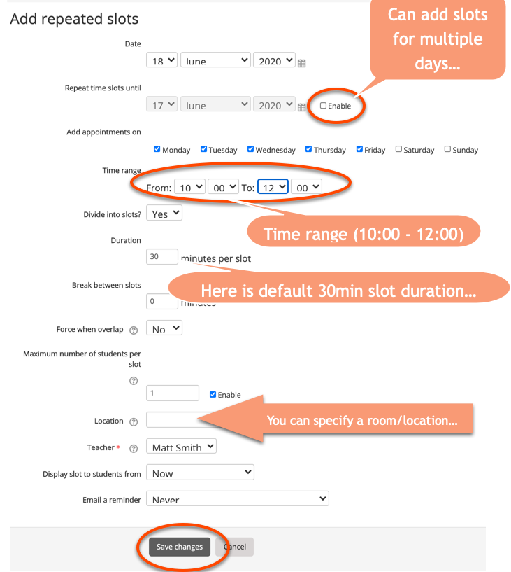
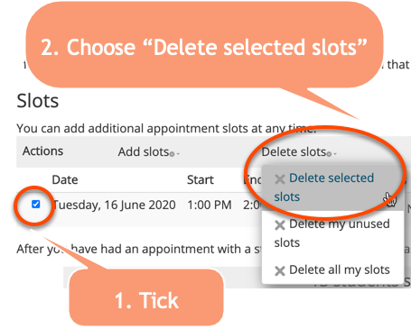

# Talk 1: Moodle Scheduler

## Introduction

The Moodle **Scheduler** is a Moodle tool allowing staff to create timetslots for given days/times, to which students can sign up.

Here is an example for fictional student **Fred Smith**:

---

## Advantages

It removes all the multiple emails / Doodle pools etc. to arrange a meeting with students. 

I create timeslots on days/times I'm available, and let students sign up to the one they find most convenient.

During April/May in 2020, each day I'd look at the next day's timeslots, and delete any empty ones, then print out the schedule. So I had a fixed set of meetings for the next day, that would not change.

I've found several advantages to using the Moodle scheduler:

1. In pre-Covid times, I used it in weeks 11 & 12 to schedule project grading one-to-ones with students. E.g. I'd:

    - book a meeting room for a few hours
    - add timeslots for that room to the Moodle scheduler
    - ask students to sign up for a timeslot for their 15-minute project defence
    
1. In Covid-times the scheduler has been useful for:

    - arranging online project supervision meetings
    
        - a student (or one from a team) sign up to a meeting timeslot
        
        - I had a single Adobe connect Meeting room I used for all supervision meetings, so they all know the URL to visit
        
    - offering students a chance for one-to-one code debugging sessions following an online lecture etc.
    
    
1. I may also use it to schedule vivas for projects in September, in the case of any student submissions I feel need further evaluation by talking to the student in person.

## Using the Moodle Scheduler

**1.** 
For the module Moodle course, add a new **Activity**:

**2.** Select **Scheduler**:

**3.** Choose name and set default timeslot duration

**4.** The scheduler appears on Moodle. Move it to where you want, and click it to edit it as a lecturer:

**5.** Add some time slots (single or repeated)

**6.** Set default duration / add time/date range

**7.** Example of student who has signed up for a timeslot

**8.** You can delete timeslots

